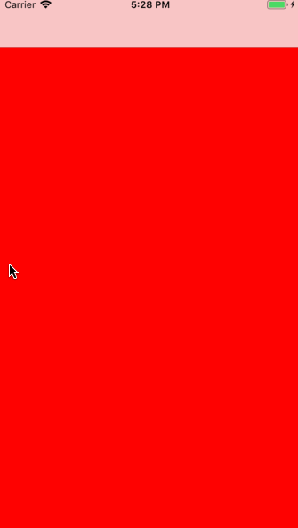

# HLMain

[](https://travis-ci.org/2461414445@qq.com/HLMain)
[](https://cocoapods.org/pods/HLMain)
[](https://cocoapods.org/pods/HLMain)
[](https://cocoapods.org/pods/HLMain)

## 概述
> 此项目简单封装了 iOS开发常用的基础框架 解决了 系统导航栏 当有导航栏透明度为0或者隐藏的情况下，滑动控制器返回有bug
> `HLNavigationController` 使用了当前APP市场主流的实现效果 滑动返回的时候全屏滚动


> `HLTabBarController`提供了两种方式创建方式
```
//链式编程
+ (instancetype)tabBarControllerWithAddChildVCsBlock: (void(^)(HLTabBarController *tabBarC))addVCBlock;
```
```
//对象方法创建
- (void)addChildVC:(UIViewController *)vc title:(NSString *)title normalImageName:(NSString *)normalImageName selectedImageName:(NSString *)selectedImageName;
```
具体实现看源码 里面有大量的注释 这里就不写了

## 例子

`git clone` 项目

`pod install` 

查看项目运行结果

## 运行效果



## 手动下载安装

- 下载项目 然后把`HLMain`文件夹下的所有文件拖到你的项目中就`com+b`编译下 看有没有报错
### 使用

- 方式一
导入`#import "HLTabBarController.h"`

```
- (BOOL)application:(UIApplication *)application didFinishLaunchingWithOptions:(NSDictionary *)launchOptions
{
// Override point for customization after application launch.

HLTabBarController *rootVC = [HLTabBarController tabBarControllerWithAddChildVCsBlock:^(HLTabBarController *tabBarC) {
[tabBarC addChildVC:[HotViewController new] title:@"首页" normalImageName:@"home" selectedImageName:@"home_press"];
[tabBarC addChildVC:[TopLineViewController new] title:@"我的" normalImageName:@"me" selectedImageName:@"me_press"];
}];
[rootVC tabBarConfigWithBarBackground:[UIColor colorWithRed:1.00f green:1.00f blue:1.00f alpha:1.00f]
titleFont:[UIFont systemFontOfSize:12]
normalTitleColor:[UIColor colorWithRed:0.56f green:0.60f blue:0.70f alpha:1.00f]
selectedColor:[UIColor colorWithRed:0.21f green:0.39f blue:0.93f alpha:1.00f]];
self.window.rootViewController = rootVC;
[self.window makeKeyAndVisible];

return YES;
}
```

- 方式二
导入你想要使用的控制器
如果只想使用导航栏控制器 可以新建一个导航栏控制器 继承`HLNavigationController` 
`HLTabBarController`和`HLNavigationController`  不相互依赖 都可以单独使用
注意：`HLNavigationController`依赖的文件有`AnimationContoller` 和 `UINavigationBar+Alpha`和`UIImage+Extension`！


## CocoaPods 安装

HLMain is available through [CocoaPods](https://cocoapods.org). To install
it, simply add the following line to your Podfile:

```ruby
pod 'HLMain'
```

### 使用
导入`#import "HLTabBarController.h"`

```
- (BOOL)application:(UIApplication *)application didFinishLaunchingWithOptions:(NSDictionary *)launchOptions
{
// Override point for customization after application launch.

HLTabBarController *rootVC = [HLTabBarController tabBarControllerWithAddChildVCsBlock:^(HLTabBarController *tabBarC) {
[tabBarC addChildVC:[HotViewController new] title:@"首页" normalImageName:@"home" selectedImageName:@"home_press"];
[tabBarC addChildVC:[TopLineViewController new] title:@"我的" normalImageName:@"me" selectedImageName:@"me_press"];
}];
[rootVC tabBarConfigWithBarBackground:[UIColor colorWithRed:1.00f green:1.00f blue:1.00f alpha:1.00f]
titleFont:[UIFont systemFontOfSize:12]
normalTitleColor:[UIColor colorWithRed:0.56f green:0.60f blue:0.70f alpha:1.00f]
selectedColor:[UIColor colorWithRed:0.21f green:0.39f blue:0.93f alpha:1.00f]];
self.window.rootViewController = rootVC;
[self.window makeKeyAndVisible];

return YES;
}
```

## Author

2461414445@qq.com

## License

HLMain is available under the MIT license. See the LICENSE file for more info.
